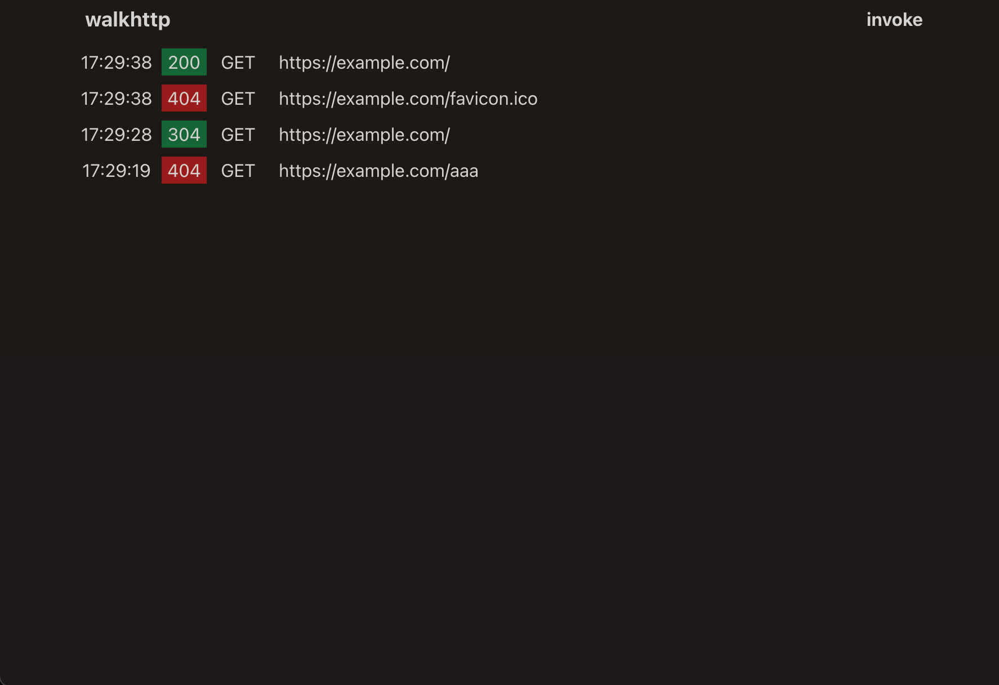
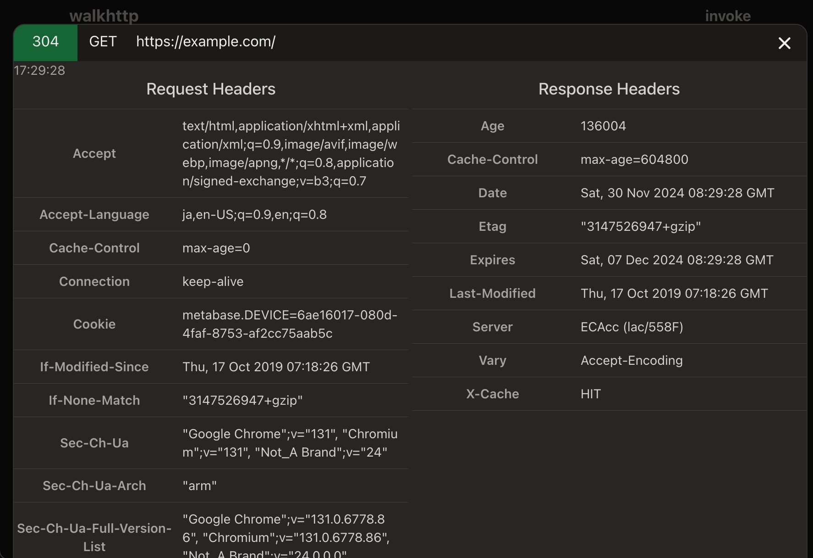

# walkhttp
A CLI tool to proxy HTTP requests for debugging.

[](https://github.com/enuesaa/walkhttp/actions/workflows/ci.yaml)

## Usage
```console
$ walkhttp --origin https://example.com
┌─────────────────────────────────────────────────────────────────
│ walkhttp
│
│ --origin https://example.com
│ --port   3000
│
│ Web console: http://localhost:3000/_
└─────────────────────────────────────────────────────────────────

 Try `curl http://localhost:3000/` and open the web console.
```

## モチベーション
- api gateway ライクなもの
- リバースプロキシ的な立ち位置で、HTTP リクエスト/レスポンスを中継する
- リクエスト/レスポンスをロギングして可観測性を上げたい
- あくまで開発用のもの。手っ取り早くトレースしたいときに使える
- めっちゃ雑に実装している

## キャプチャ


